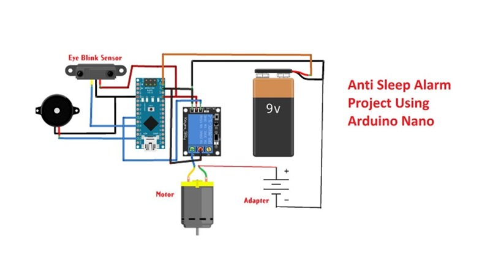
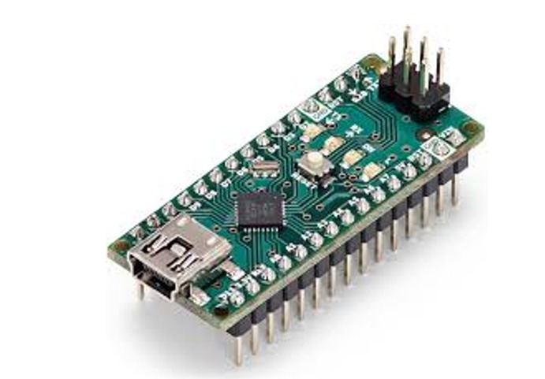
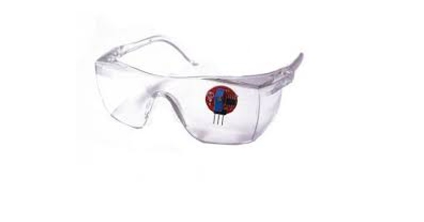
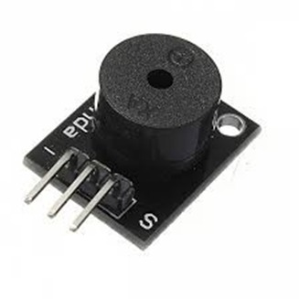
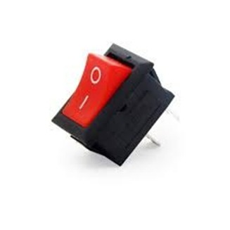

# Anti Sleep Glasses 👓

Smart wearable glasses that detect driver drowsiness using an eye blink sensor and alert the user using a buzzer and vibration motor.

---

## Project Overview

Drowsy driving is a major cause of road accidents. This project introduces Anti Sleep Glasses that monitor eye blinking patterns using sensors and a microcontroller.

When the eyes remain closed for more than 3 seconds, the system activates an alert mechanism to wake the user.

---

## Working Principle

1. Eye blink sensor detects eye movement
2. Sensor sends signal to Arduino Nano
3. Arduino checks if eyes remain closed for 3 seconds
4. If drowsiness detected
5. Buzzer and vibration motor activate

---

## Block Diagram

## Components

### Arduino Nano

### Eye Blink Sensor

### Buzzer

### Power Supply

### Switch

---

## Applications

• Driver safety  
• Truck drivers  
• Night shift workers  
• Industrial safety

---

## Future Improvements

• AI based detection
• Smartphone integration
• Augmented reality alerts
• Sleep analytics

---

## Project Report

The detailed documentation of this project is available in the repository.

📄 **Project Report:**  
[Anti Sleep Glasses Project Report](docs/antisleep_glasses_report_.pdf)

---

## Contributors
Mariyam Shaji Ambooken, 
Gayathri Rajesh,
Utsa Ghosh
